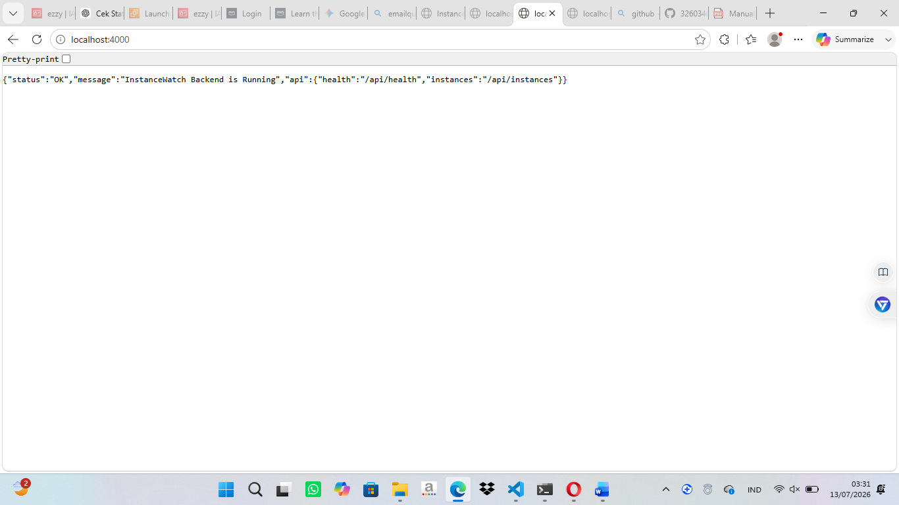
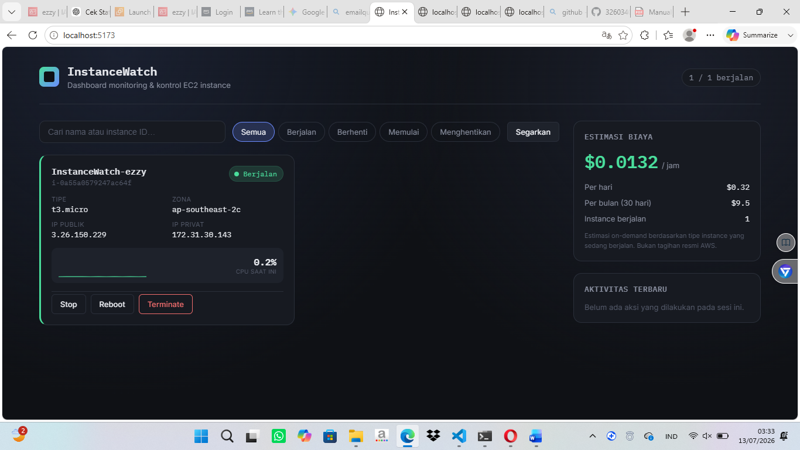

# InstanceWatch
### Dashboard Monitoring & Kontrol Amazon EC2 Instance

InstanceWatch menampilkan seluruh EC2 instance pada akun AWS kamu dalam bentuk kartu status
real-time, lengkap dengan grafik CPU utilization, aksi start/stop/reboot/terminate, estimasi
biaya berjalan, dan riwayat aktivitas.


**Nama : Ezzy Kurbana**  
**NIM : 32602400047**  
**Mata Kuliah : Cloud Computing**  
**Tugas Besar (Individu)**

---

# Deskripsi Proyek

InstanceWatch adalah aplikasi berbasis web yang dibuat untuk memantau dan mengelola Amazon EC2 Instance secara real-time menggunakan layanan Amazon Web Services (AWS).

Aplikasi ini memungkinkan pengguna untuk melihat daftar seluruh EC2 Instance, memonitor status server, penggunaan CPU melalui Amazon CloudWatch, melakukan kontrol instance (Start, Stop, Reboot, dan Terminate), serta menghitung estimasi biaya penggunaan instance berdasarkan harga On-Demand AWS.

Aplikasi dibangun menggunakan:

- **Frontend** : React + Vite
- **Backend** : Express.js (Node.js)
- **Cloud Service** : Amazon EC2 & Amazon CloudWatch
- **AWS SDK** : AWS SDK v3

---

# 📷 Demo Aplikasi

## Backend

Backend berjalan pada `http://localhost:4000`.



---

## Dashboard InstanceWatch

Frontend berjalan pada `http://localhost:5173`.



# Fitur Utama

✅ Menampilkan seluruh EC2 Instance pada akun AWS

✅ Menampilkan informasi:

- Nama Instance
- Instance ID
- Status Instance
- Instance Type
- Availability Zone
- Public IP
- Private IP

✅ Monitoring CPU Utilization secara real-time menggunakan Amazon CloudWatch

✅ Kontrol Instance:

- Start Instance
- Stop Instance
- Reboot Instance
- Terminate Instance

✅ Estimasi biaya penggunaan:

- Per Jam
- Per Hari
- Per Bulan

✅ Riwayat aktivitas pengguna

✅ Auto Refresh setiap 30 detik

✅ Pencarian Instance berdasarkan Nama atau Instance ID

✅ Filter Status Instance

- Semua
- Running
- Stopped
- Pending
- Stopping

---

# Struktur Folder

```
instancewatch/
│
├── backend/
│   ├── data/
│   │   └── logs.json
│   │
│   ├── routes/
│   │   └── instances.js
│   │
│   ├── services/
│   │   ├── cloudwatchService.js
│   │   ├── costService.js
│   │   └── ec2Service.js
│   │
│   ├── .env.example
│   ├── package.json
│   └── server.js
│
├── frontend/
│   ├── public/
│   ├── src/
│   │   ├── components/
│   │   ├── services/
│   │   ├── App.jsx
│   │   └── main.jsx
│   │
│   ├── vite.config.js
│   └── package.json
│
├── README.md
└── .gitignore
```

---

# Persyaratan

Sebelum menjalankan aplikasi, pastikan telah menginstall:

- Node.js versi 18 atau lebih baru
- npm
- Akun AWS
- Minimal memiliki 1 EC2 Instance
- AWS IAM User dengan Access Key

Permission IAM yang diperlukan:

```
ec2:DescribeInstances
ec2:StartInstances
ec2:StopInstances
ec2:RebootInstances
ec2:TerminateInstances
cloudwatch:GetMetricStatistics
```

---

# Konfigurasi AWS

Salin file:

```
backend/.env.example
```

Menjadi

```
backend/.env
```

Kemudian isi seperti berikut:

```env
AWS_REGION=ap-southeast-2
AWS_ACCESS_KEY_ID=YOUR_ACCESS_KEY
AWS_SECRET_ACCESS_KEY=YOUR_SECRET_KEY
PORT=4000
```

> Jangan pernah mengunggah file `.env` ke GitHub karena berisi kredensial AWS.

---

# Menjalankan Backend

Masuk ke folder backend

```bash
cd backend
```

Install dependency

```bash
npm install
```

Menjalankan server

```bash
npm start
```

Backend berjalan pada

```
http://localhost:4000
```

---

# Menjalankan Frontend

Masuk ke folder frontend

```bash
cd frontend
```

Install dependency

```bash
npm install
```

Jalankan aplikasi

```bash
npm run dev
```

Frontend berjalan pada

```
http://localhost:5173
```

---

# Endpoint API

## Health Check

```
GET /api/health
```

Contoh Response

```json
{
  "status": "ok",
  "region": "ap-southeast-2"
}
```

---

## Daftar EC2

```
GET /api/instances
```

Response

```json
{
  "instances": [
    {
      "id": "i-xxxxxxxx",
      "name": "InstanceWatch",
      "state": "running",
      "type": "t3.micro"
    }
  ]
}
```

---

# Cara Menggunakan Aplikasi

1. Jalankan Backend
2. Jalankan Frontend
3. Login ke AWS menggunakan Access Key pada file `.env`
4. Dashboard akan otomatis menampilkan seluruh EC2 Instance
5. Pilih Instance yang ingin dikelola
6. Gunakan tombol:

- Start
- Stop
- Reboot
- Terminate

7. Monitoring CPU dapat dilihat secara langsung melalui grafik CloudWatch.
8. Estimasi biaya akan dihitung otomatis berdasarkan Instance yang sedang berjalan.

---

# Teknologi yang Digunakan

## Frontend

- React
- Vite
- CSS

## Backend

- Node.js
- Express.js
- AWS SDK v3

## Cloud Service

- Amazon EC2
- Amazon CloudWatch

---

# Tampilan Aplikasi

Dashboard menampilkan:

- Informasi seluruh EC2 Instance
- Monitoring CPU
- Status Instance
- Biaya penggunaan
- Aktivitas terbaru

---

# Keamanan

Untuk menjaga keamanan akun AWS:

- File `.env` tidak boleh diunggah ke GitHub.
- Gunakan `.env.example` sebagai contoh konfigurasi.
- Simpan AWS Access Key dan Secret Key dengan aman.

---

# Hasil Pengujian

Pengujian menunjukkan bahwa aplikasi berhasil:

- Menghubungkan ke AWS
- Menampilkan daftar EC2
- Menampilkan status instance
- Monitoring CPU melalui CloudWatch
- Menjalankan aksi Start
- Menjalankan aksi Stop
- Menjalankan aksi Reboot
- Menjalankan aksi Terminate
- Menghitung estimasi biaya penggunaan

---

# Penutup

InstanceWatch merupakan aplikasi monitoring dan manajemen Amazon EC2 berbasis web yang dibangun menggunakan React, Express.js, dan AWS SDK. Aplikasi ini memudahkan pengguna dalam memonitor kondisi instance secara real-time, melakukan kontrol server, serta memperkirakan biaya penggunaan layanan AWS dalam satu dashboard yang sederhana dan mudah digunakan.

---

## Identitas Penyusun

**Nama : Ezzy Kurbana**

**NIM : 32602400047**

**Mata Kuliah : Cloud Computing**
